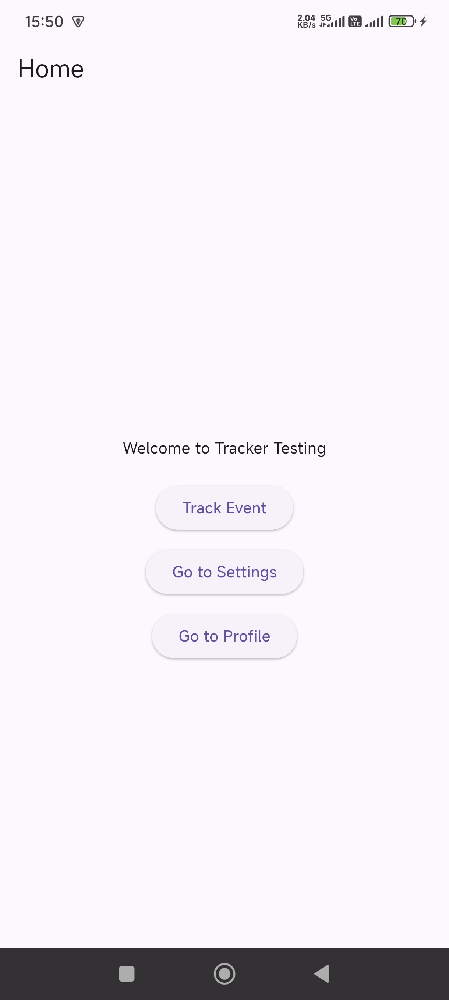
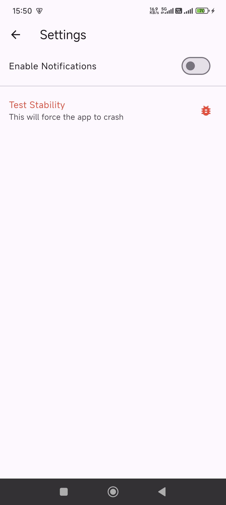
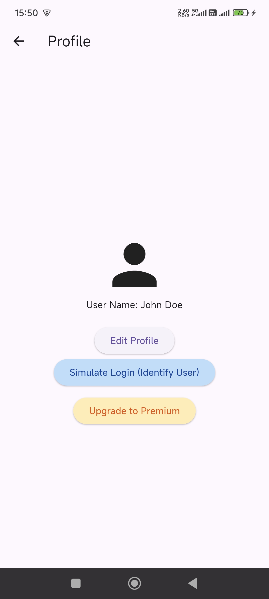
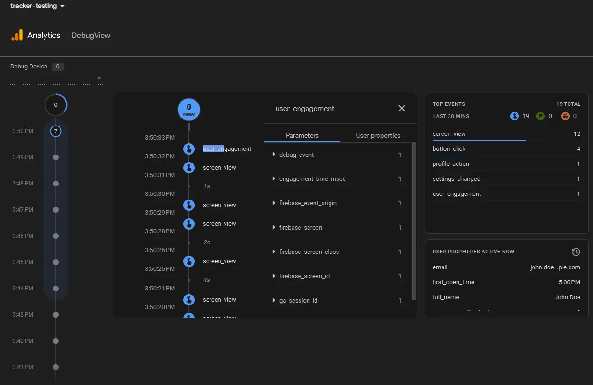
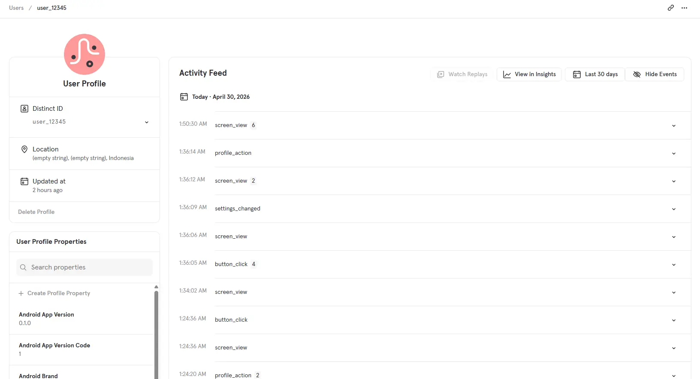
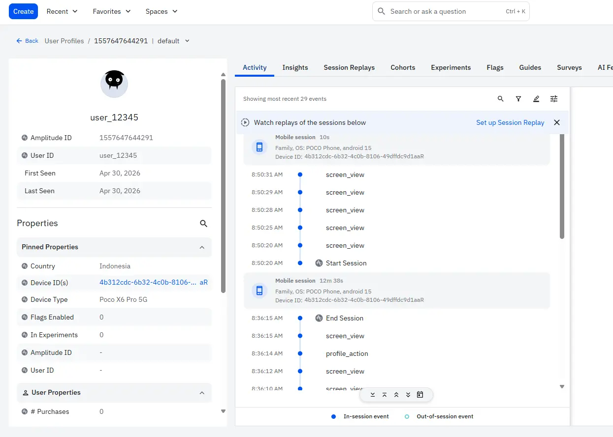
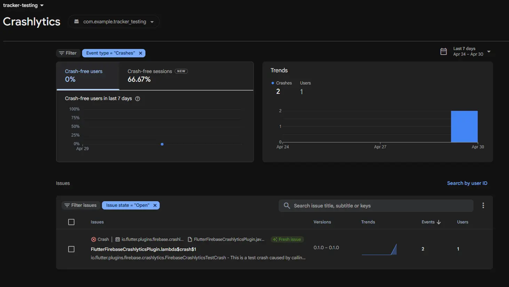

# Analytics Implementation Report: Tracker Testing App

## 1. Summary
This report outlines the implementation of a modular, multi-provider tracking
architecture. The system is designed for high scalability and data
accuracy using Clean Architecture principles.

## 2. Technical Architecture
- **Framework**: Flutter
- **Pattern**: Feature-First
- **Dependency Injection**: GetIt (Service Locator)
- **State Management**: BLoC / Provider

## 3. Tracker Providers
I implemented a decoupled provider system sending data to three specialized platforms:

1. **Firebase**: Infrastructure, App Health (Crashlytics), and Marketing.
2. **Mixpanel**: Behavioral Funnels and User Retention.
3. **Amplitude**: Deep User Journey Analysis and Segmentation.

## 4. Key Implementation Features
- **Manual Navigation Tracking**: Used `RouteAware` to ensure "Back" navigation is recorded.
- **User Identification**: Linking anonymous data to unique IDs (`user_12345`).
- **Stability Monitoring**: Automated crash reporting via Firebase Crashlytics.
- **Environment Safety**: Secrets managed via `--dart-define`.

## 5. Event Dictionary
| Event Name | Trigger | Parameters | Purpose |
| :--- | :--- | :--- | :--- |
| `screen_view` | Page visible | `screen_name` | Monitor navigation |
| `button_click` | Home buttons | `button_name` | Measure interaction |
| `settings_changed`| Toggle switch | `setting_name`, `value` | Track preferences |
| `profile_action` | Edit button | `type` | Monitor conversion |

## 6. Implementation Validation
The following screenshots demonstrate the user interface and the tracking data flow.

| Home Page | Settings Page | Profile Page |
| :---: | :---: | :---: |
|  |  |  |

| Firebase |
| :---: |
|  |

| Mixpanel |
| :---: |
|  |

| Amplitude |
| :---: |
|  |

| Crashlytics |
| :---: |
|  |

## 7. Architecture Overview
The system follows **Clean Architecture** to ensure the UI is decoupled from the tracking SDKs:
- **Presentation**: Pages call the `TrackingService`.
- **Domain**: UseCases (`TrackEvent`, `TrackScreen`, etc.) define the business logic.
- **Data**: Repositories coordinate multiple `Providers` (Firebase, Mixpanel, Amplitude).

## 8. Setup & Local Development
To run this project, you need to provide the API tokens via `--dart-define` at build time. 

**Run Command:**
```bash
flutter run \
  --dart-define=MIXPANEL_TOKEN=YOUR_TOKEN \
  --dart-define=AMPLITUDE_TOKEN=YOUR_TOKEN
```

*Note: You can also configure these in your `.vscode/launch.json` (which is ignored by Git for security).*
